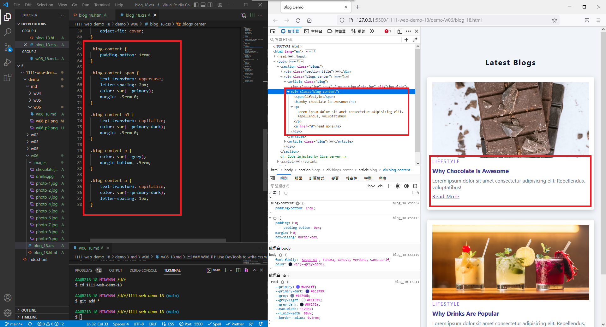
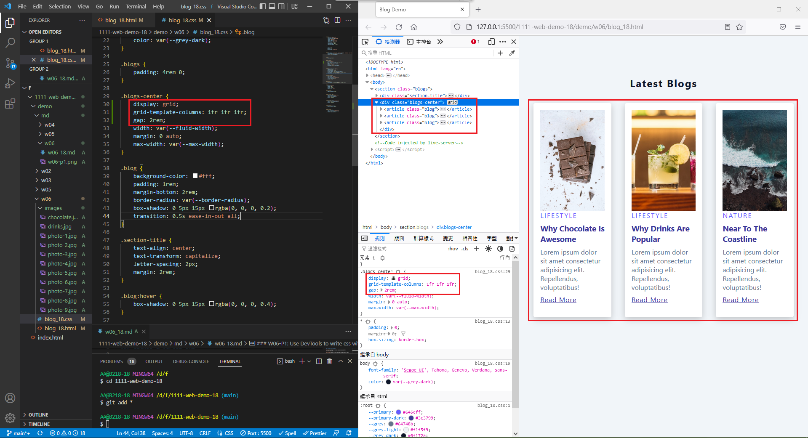

### Github & Vercel URL

[Github URL](https://github.com/whitestorm2346/1111-web-demo-18)

[Vercel URL](https://1111-web-demo-18-m55w.vercel.app/)

### W06-P1: Add blog content with css



### W06-P2: Use css grid to show 3 blogs



### W06-P3: Use css auto-fit to show all blogs


### W06-logs: W6 all logs

```
$ git log --pretty=format:"%h%x09%an%x09%ad%x09%s" --after="2022-10-04"
8e9f277 whitestorm2346  Wed Oct 12 15:05:25 2022 +0800  Use css grid to show 3 blogs
4734ddb whitestorm2346  Wed Oct 12 14:44:21 2022 +0800  Add blog content with css
b832fc7 whitestorm2346  Wed Oct 5 15:00:14 2022 +0800   W05-P2: Add more details for blog class selector
e5b0c46 whitestorm2346  Wed Oct 5 14:04:00 2022 +0800   W05-P1: Use DevTools to write css with img class selector
```
