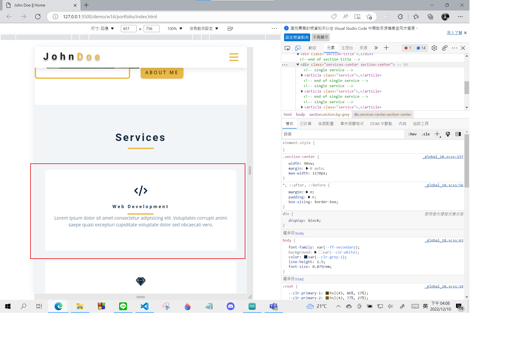
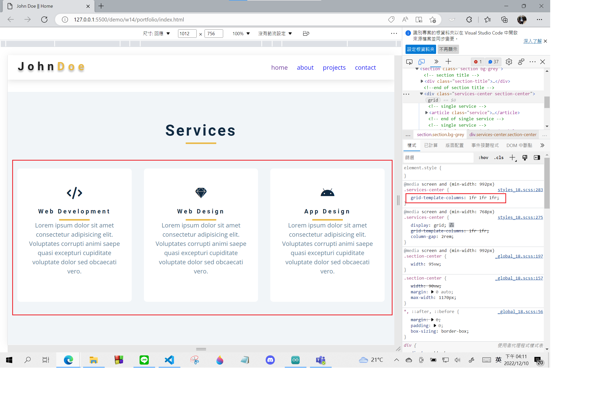

### Github & Vercel URL

[Github URL](https://github.com/whitestorm2346/1111-web-demo-18)

[Vercel URL](https://1111-web-demo-18-m55w.vercel.app/)

### W14-P1: file structures for final project


### W14-P2: social icons using global css, and custom css


### W14-P3: Services section with responsive design with phone, pad and desktop computer






### W14-P4: finish About section with responsive design with phone, and desktop computer


### W14-logs: W14 all logs


```
$ git log --pretty=format:"%h%x09%an%x09%ad%x09%s" --after="2022-12-06"
b6d1dbf whitestorm2346  Sat Dec 10 16:29:10 2022 +0800  W14-P4: finish About section with responsive design with phone, and desktop computer
c30781a whitestorm2346  Sat Dec 10 16:13:42 2022 +0800  w14-P3: Services section with responsive design with phone, pad and desktop computer
39f1c5a whitestorm2346  Wed Dec 7 15:03:13 2022 +0800   about section need to be finished
90cfa10 whitestorm2346  Wed Dec 7 14:05:02 2022 +0800   W14-P2: social icons using global css, and custom css
8db0cd0 whitestorm2346  Wed Dec 7 13:38:16 2022 +0800   W14-P1: file structures for final project
```
