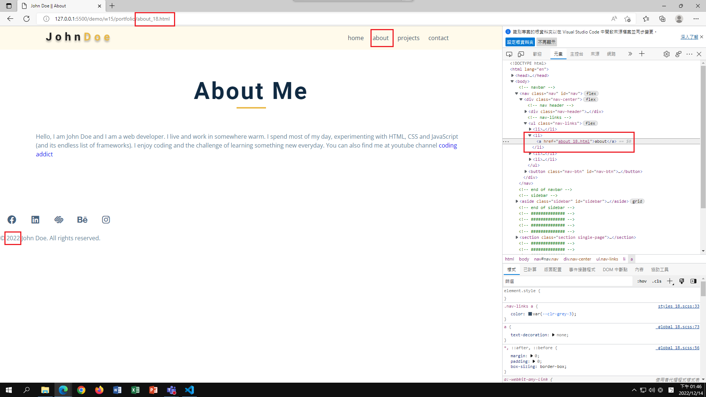

### Github & Vercel URL

[Github URL](https://github.com/whitestorm2346/1111-web-demo-18)

[Vercel URL](https://1111-web-demo-18-m55w.vercel.app/)

### W15-P1: nav link to about page with navbar and footer




### W15-P2: display project-center using grid and RWD designing


### W15-logs: W15 all logs


```
$ git log --pretty=format:"%h%x09%an%x09%ad%x09%s" --after="2022-12-13"

498aac0 whitestorm2346  Sat Dec 17 21:29:57 2022 +0800  W15-P2: display project-center using grid and RWD designing
b34e312 whitestorm2346  Sat Dec 17 16:50:10 2022 +0800  Fixed the problem of demo_18.html
363597a whitestorm2346  Sat Dec 17 02:27:24 2022 +0800  Finished the navbar and sidebar part
75c3f81 whitestorm2346  Fri Dec 16 23:44:38 2022 +0800  Started to implement the navbar part
:...skipping...
498aac0 whitestorm2346  Sat Dec 17 21:29:57 2022 +0800  W15-P2: display project-center using grid and RWD designing
b34e312 whitestorm2346  Sat Dec 17 16:50:10 2022 +0800  Fixed the problem of demo_18.html
363597a whitestorm2346  Sat Dec 17 02:27:24 2022 +0800  Finished the navbar and sidebar part
75c3f81 whitestorm2346  Fri Dec 16 23:44:38 2022 +0800  Started to implement the navbar part
e31bc3d whitestorm2346  Wed Dec 14 15:03:28 2022 +0800  W15-P2 haven't finished
e83ac2f whitestorm2346  Wed Dec 14 13:50:57 2022 +0800  W15-P1: nav link to about page with navbar and footer
```
