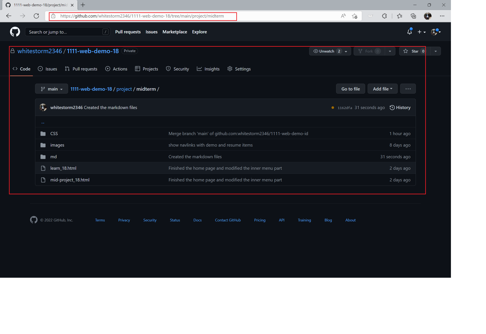

### Github & Vercel URL

[Github URL](https://github.com/whitestorm2346/1111-web-demo-18)

[Vercel URL](https://1111-web-demo-18-m55w.vercel.app/)

[Midterm Project Github URL](https://github.com/whitestorm2346/1111-web-demo-18/tree/main/project/midterm)



[Midterm Project Vercel URL](https://1111-web-demo-18-m55w.vercel.app/project/midterm/mid-project_18.html)


### md file structure


### midterm-P1: class demo of week 8 and week 9

[Week 8 Github URL](https://github.com/whitestorm2346/1111-web-demo-18/blob/main/demo/md/w08/w08_18.md)


[Week 9 Github URL](https://github.com/whitestorm2346/1111-web-demo-18/blob/main/demo/md/w09/w09_18.md)


### midterm-P2: works

#### My program projects part


#### My volleyball competitions part

##### 點擊卡片可以到指定貼文的連結

##### 游標放在卡片上會改變陰影顏色

##### 游標放在照片上會有縮小效果


### midterm-P3: resume


##### skills 使用 grid 來排版


### midterm-P4: learning

#### 問題解決


#### 自主學習


#### 學習心得


### midterm-logs: all logs for midterm projects

```bash
$ git log --pretty=format:"%h%x09%an%x09%ad%x09%s" --after="2022-11-04"
```
